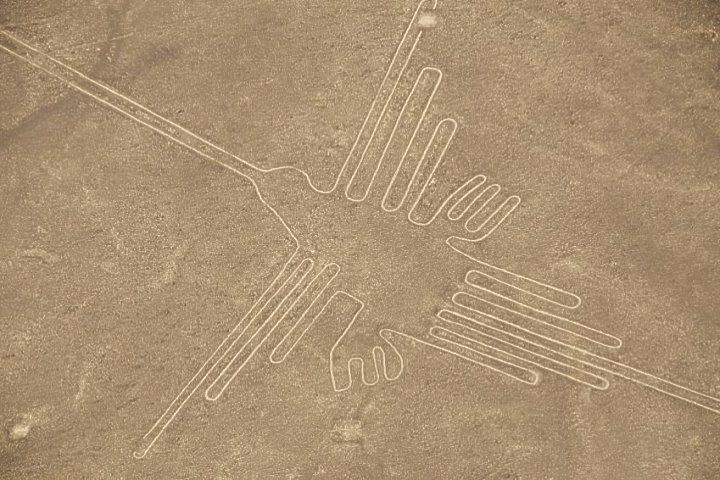
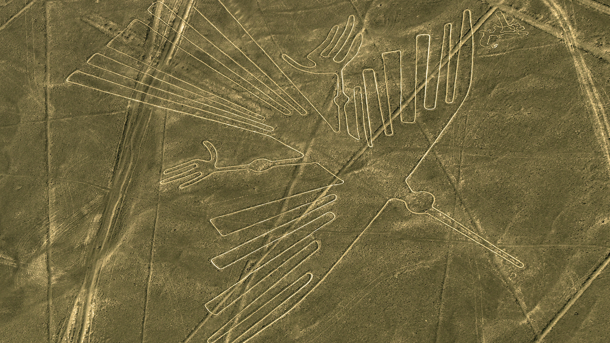

# week-4-project
 
 Inspired by my family trip in Peru a few years ago to make an interactive self-explanatory, educational map that showcase the history, location, and background of each geoglyths along the Nazca Lines.
 

 Referencing from <a href="https://www.heritagedaily.com/2018/04/10-ancient-geoglyphs/118915">10 Ancient Geoglyths0</a> &
<a href="https://www.heritagedaily.com/2020/04/the-nazca-lines-interactive-map/127496">THE NAZCA LINES & INTERACTIVE MAP</a>
 

 
 <strong>Tools</strong>: <ins>Geojson</ins>, <ins>mapbox</ins>, <ins>html</ins>, <ins>css</ins>, <ins>javascript</ins>

                  
                        
                        
                        
                        
                        
                        
                    

